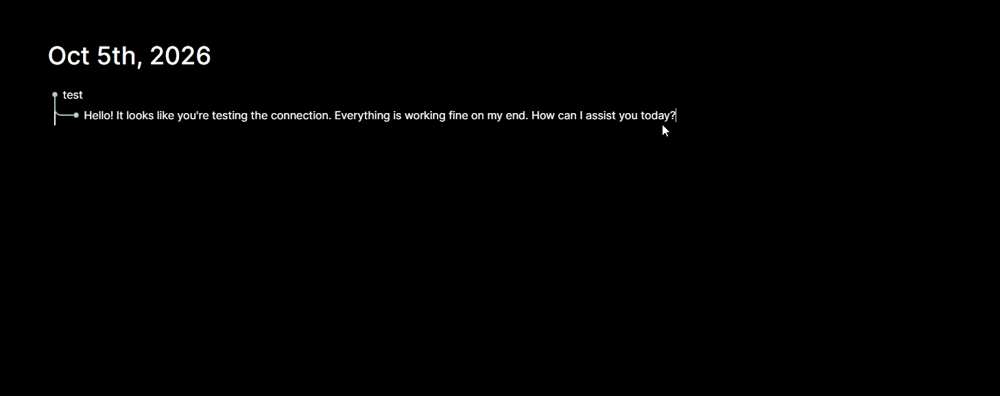

# Logseq AI Hub

Transform Logseq into a central orchestration layer for AI workflows, MCP tools, and automated task management.

[](https://github.com/escherbridge/logseq-ai-hub/actions/workflows/ci.yml)
[](LICENSE)



*`/LLM` in a journal page — block content goes to your configured model and the reply lands as a child block. The same command also resolves `[[MCP/server]]` and `[[AI-Memory/tag]]` references for tool use and context.*

---

## Table of Contents

- [Architecture Overview](#architecture-overview)
- [Features](#features)
- [Prerequisites](#prerequisites)
- [Installation](#installation)
- [Quick Start](#quick-start)
- [Configuration](#configuration)
- [MCP Integration](#mcp-integration)
- [Slash Commands](#slash-commands)
- [Development](#development)
- [Troubleshooting](#troubleshooting)
- [Documentation](#documentation)
- [License](#license)

---

## Architecture Overview

```
                                                                              ┌─────────────┐
┌─────────────────┐     SSE + HTTP      ┌──────────────────┐     MCP/HTTP    │  MCP Clients │
│  Logseq Plugin  │◄──────────────────►│  AI Hub Server   │◄──────────────►│ (Claude, etc)│
│ (ClojureScript) │   Agent Bridge      │ (Bun/TypeScript) │                 └─────────────┘
└────────┬────────┘   52 operations     └────────┬─────────┘
         │                                       │
         ▼                                       ▼
    Logseq Graph                           SQLite Database
   (Pages & Blocks)                       (Events, Sessions)
```

**Logseq Plugin** -- A ClojureScript application compiled via shadow-cljs that runs inside the Logseq desktop app. It provides slash commands, manages memory and secrets, orchestrates the job runner, and handles the plugin side of the Agent Bridge.

**AI Hub Server** -- A Bun/TypeScript HTTP server that acts as the external brain. It stores events, sessions, and contacts in SQLite; exposes an MCP server for AI assistants; manages messaging webhooks (WhatsApp, Telegram); and bridges requests to the plugin over SSE.

**Agent Bridge** -- A bidirectional communication layer using Server-Sent Events (SSE) for server-to-plugin messages and HTTP callbacks for plugin-to-server responses. The bridge supports 52 distinct operations covering graph manipulation, job control, memory, secrets, registry, code-repo, and more.

**MCP Server** -- Implements the Model Context Protocol with tools, resources, and prompt templates so that AI assistants like Claude can read your knowledge graph, manage jobs, store memories, and trigger automations.

---

## Features

- **Job Runner** -- Autonomous skill-based automation. Define skills as Logseq pages, schedule and execute jobs with full LLM tool-use loops, cron scheduling, pause/resume, and retry logic.

- **MCP Server** -- 80+ tools, 13 resources, and 7 prompt templates exposed via the Model Context Protocol for AI assistants to interact with your knowledge graph.

- **Agent Bridge** -- 52 bidirectional operations between plugin and server via SSE streaming + HTTP callbacks, enabling real-time graph manipulation from external AI agents.

- **AI Memory** -- Persistent memory stored as Logseq pages under a configurable prefix (`AI-Memory/` by default) with tag-based retrieval, full-text Datalog search, and LLM context injection.

- **Secrets Vault** -- Encrypted secret storage in plugin settings with template interpolation (`{{secret.KEY}}`). Secrets are never logged or exposed in error messages. Supports up to 100 keys.

- **Event Hub** -- Event-driven automation with pattern matching, graph persistence, webhook support, and SSE-based real-time event dispatching between plugin and server.

- **Human-in-the-Loop** -- Approval workflows for agent actions requiring human confirmation before execution.

- **KB Tool Registry** -- Knowledge-base driven tool registration. Define tools, skills, prompts, agents, and procedures as Logseq pages. Auto-scanned and watched for changes.

- **Dynamic Argument Parser** -- The `/LLM` command preprocesses `[[MCP/server]]` references for on-demand MCP tool-use and `[[AI-Memory/tag]]` references for contextual memory injection. Both are chainable in a single query.

- **Code Repo Integration** -- Link code projects to your knowledge graph with ADRs (Architecture Decision Records), lessons learned, safeguard policies, work tracking, and deployment procedures.

- **Agent Sessions** -- Multi-turn conversational agent sessions with message history, tool use, and configurable message limits, stored in SQLite.

- **Messaging Integration** -- WhatsApp and Telegram webhook ingestion with automatic conversation page creation in Logseq. Supports bidirectional messaging via the server API.

---

## Prerequisites

| Requirement | Version | Purpose |
|---|---|---|
| Node.js | >= 18 | Plugin dependency management |
| Java JDK | >= 11 | ClojureScript compilation via shadow-cljs |
| Bun | >= 1.0 | Server runtime |
| Logseq | Desktop app | Host environment for the plugin |
| LLM API Key | -- | Required for AI features (OpenRouter recommended) |

Only the LLM key and the Logseq desktop app are needed to *use* the plugin from a release; Node, Java and Bun are for building it and running the server yourself.

---

## Installation

### 1. Install the plugin

**From the Logseq Marketplace** (recommended): open Logseq, go to **Settings** > **Plugins** > **Marketplace**, search for **Logseq AI Hub** and click **Install**.

**From a release zip** (manual): download `logseq-ai-hub-<version>.zip` from the [latest release](https://github.com/escherbridge/logseq-ai-hub/releases/latest), unzip it, enable **Developer mode** under **Settings** > **Advanced**, then **Plugins** > **Load unpacked plugin** and pick the unzipped folder.

The plugin works on its own for local features (memory, secrets, job runner, registry). Messaging, MCP tool exposure and the Event Hub need the companion server below.

### 2. Deploy the server

The server is a single Bun process with a SQLite database. Any host that runs a Dockerfile works; `server/` ships a `Dockerfile` and a `railway.json` with the healthcheck pre-configured.

**Railway**

1. Create a service from this GitHub repository and set its **Root Directory** to `/server`.
2. Attach a **Volume** mounted at `/app/data` (SQLite lives there and must survive redeploys).
3. Set the variables below, then generate a public domain for the service.

| Variable | Required | Value |
|---|---|---|
| `PLUGIN_API_TOKEN` | yes | `openssl rand -hex 32` — the shared secret the plugin presents as `Authorization: Bearer` |
| `DATABASE_PATH` | yes | `/app/data/hub.sqlite` (inside the mounted volume) |
| `LLM_API_KEY` | for AI features | your OpenRouter (or OpenAI-compatible) key |
| `WEBHOOK_SECRET` | recommended | `openssl rand -hex 24`; inbound `/webhook/event/:source` calls must send it as `X-Webhook-Secret` |

The full variable list is in [`server/.env.example`](server/.env.example). `GET /health` returns `{"status":"ok", ...}` once the service is up.

**Docker (any host)**

```bash
cd server
docker build -t logseq-ai-hub-server .
docker run -p 3000:3000 -v "$PWD/data:/app/data" \
  -e PLUGIN_API_TOKEN=... -e DATABASE_PATH=/app/data/hub.sqlite -e LLM_API_KEY=... \
  logseq-ai-hub-server
```

### 3. Connect the plugin to the server

In Logseq open **Settings** > **Plugin Settings** > **Logseq AI Hub** and set:

- **Webhook Server URL** — the server's public URL (e.g. `https://logseq-ai-hub-production.up.railway.app`)
- **Authentication Mode** — `token`
- **Plugin API Token** — the same `PLUGIN_API_TOKEN` value you gave the server

The plugin opens an SSE connection to the server on load; the server's `/health` reports `agentApi.pluginConnected: true` once it is linked.

### Receiving webhooks (e.g. Railway deploy events)

Any service that can POST JSON can feed the Event Hub: point it at `https://<server>/webhook/event/<source>` with the header `X-Webhook-Secret: <WEBHOOK_SECRET>`. The payload is published as a `webhook.received` event from `webhook:<source>`, and Event Hub subscriptions in your graph can route it to pages, skills or jobs. For Railway itself, add a project webhook (Project Settings > Webhooks) with that URL and header and pick the deployment events you care about.

---

## Quick Start

### Plugin Development

```bash
git clone https://github.com/escherbridge/logseq-ai-hub.git
cd logseq-ai-hub
yarn install
npx shadow-cljs watch app
```

Then load the plugin into Logseq:

1. Open Logseq desktop app
2. Go to **Settings** > **Advanced** > enable **Developer mode**
3. Click **Load unpacked plugin** and select the repository folder

The plugin will hot-reload as you make changes while `shadow-cljs watch` is running.

### Server

```bash
cd server
bun install
cp .env.example .env
# Edit .env with your PLUGIN_API_TOKEN and LLM_API_KEY
bun run dev
```

Generate a strong API token for `PLUGIN_API_TOKEN`:

```bash
openssl rand -hex 32
```

Set the same token in both the server `.env` file and the plugin settings within Logseq (Settings > Plugin Settings > Logseq AI Hub > Plugin API Token).

---

## Configuration

### Environment Variables (Server)

| Variable | Required | Default | Description |
|---|---|---|---|
| `PORT` | No | `3000` | Server port |
| `PLUGIN_API_TOKEN` | **Yes** | -- | Shared auth token between plugin and server |
| `DATABASE_PATH` | No | `./data/hub.sqlite` | SQLite database path |
| `LLM_API_KEY` | No | -- | LLM provider API key (also reads `OPENROUTER_API_KEY`) |
| `LLM_ENDPOINT` | No | `https://openrouter.ai/api/v1` | LLM API endpoint |
| `AGENT_MODEL` | No | `anthropic/claude-sonnet-4` | Default LLM model |
| `AGENT_REQUEST_TIMEOUT` | No | `30000` | LLM request timeout (ms) |
| `SESSION_MESSAGE_LIMIT` | No | `50` | Max messages per agent session |
| `EVENT_RETENTION_DAYS` | No | `30` | Days to retain events before purging |
| `HTTP_ALLOWLIST` | No | `[]` | JSON array of allowed outbound domains |
| `LIST_LIMIT_MAX` | No | `100` | Max items in list responses |
| `WEBHOOK_SECRET` | No | -- | Secret for webhook signature validation |
| `WHATSAPP_VERIFY_TOKEN` | No | -- | WhatsApp webhook verification token |
| `WHATSAPP_ACCESS_TOKEN` | No | -- | WhatsApp Cloud API access token |
| `WHATSAPP_PHONE_NUMBER_ID` | No | -- | WhatsApp phone number ID |
| `TELEGRAM_BOT_TOKEN` | No | -- | Telegram bot token |
| `LLM_HTTP_REFERER` | No | -- | HTTP-Referer header for OpenRouter ranking |
| `LLM_TITLE` | No | -- | X-Title header for OpenRouter ranking |

### Plugin Settings

Configure these in Logseq under **Settings > Plugin Settings > Logseq AI Hub**:

| Setting | Description | Default |
|---|---|---|
| Webhook Server URL | URL of your AI Hub server | -- |
| Plugin API Token | Shared auth token (must match server) | -- |
| Enable AI Memory | Toggle the memory system | `false` |
| Memory Page Prefix | Prefix for memory pages | `AI-Memory/` |
| LLM API Key | Your LLM provider API key | -- |
| LLM API Endpoint | LLM API URL | `https://openrouter.ai/api/v1` |
| LLM Model Name | Model identifier | `anthropic/claude-sonnet-4` |
| Page Reference Link Depth | Levels of `[[links]]` to follow for context | `0` |
| Page Reference Max Tokens | Token budget for injected page context | `8000` |
| Enable Job Runner | Toggle the job runner system | `false` |
| Max Concurrent Jobs | Simultaneous job limit | `3` |
| Poll Interval (ms) | Runner poll frequency | `5000` |
| Default Job Timeout (ms) | Job execution timeout | `300000` |
| Job Page Prefix | Prefix for job pages | `Jobs/` |
| Skill Page Prefix | Prefix for skill pages | `Skills/` |
| MCP Server Configs | JSON array of MCP server configs | `[]` |
| Secrets Vault | JSON object of secret key-value pairs | `{}` |
| Enable Pi.dev Agent Platform | Toggle pi.dev integration | `false` |
| Pi.dev Install Path | Path to pi CLI binary | -- |
| Pi.dev Default Model | Default model for pi.dev sessions | `anthropic/claude-sonnet-4` |
| Pi.dev RPC Port | RPC communication port (0 = auto) | `0` |
| Pi.dev Max Concurrent Sessions | Concurrent pi.dev session limit | `3` |
| Enable Event Hub | Toggle event-driven automation | `true` |
| HTTP Allowlist | JSON array of allowed outbound domains | `[]` |
| Event Retention Days | Days before auto-pruning events | `30` |
| Persist Events to Graph | Write events to Logseq pages | `true` |

---

## MCP Integration

The server exposes a full MCP (Model Context Protocol) endpoint for AI assistants.

### Connecting Claude Desktop or Claude Code

The server provides a discovery endpoint at `GET /mcp/config` that returns the configuration snippet. You can also configure it manually:

```json
{
  "mcpServers": {
    "logseq-ai-hub": {
      "type": "url",
      "url": "http://localhost:3000/mcp",
      "headers": {
        "Authorization": "Bearer <YOUR_PLUGIN_API_TOKEN>"
      }
    }
  }
}
```

### Endpoint Details

- **URL**: `POST /mcp` (Streamable HTTP transport)
- **Auth**: `Authorization: Bearer <PLUGIN_API_TOKEN>` header
- **Sessions**: The server manages per-session transports with automatic session ID tracking via the `mcp-session-id` header
- **Termination**: `DELETE /mcp` to end a session

### Available MCP Capabilities

**Tools** (~80+) -- Graph operations (query, search, page CRUD, block append/update), job management (create, list, start, cancel, pause, resume), skill management, memory operations, secrets management, registry operations, session management, code-repo integration (projects, ADRs, lessons, safeguards, work tracking, tasks), pi.dev agent management, event hub operations, messaging, character management, and approval workflows.

**Resources** (13) -- `logseq://pages/{name}`, `logseq://jobs`, `logseq://skills`, `logseq://memory/{tag}`, `logseq://projects/{name}`, `logseq://contacts`, `logseq://characters`, `logseq://characters/{id}`, `logseq://character-sessions/{characterId}`, `logseq://projects/{name}/adrs`, `logseq://projects/{name}/lessons`, `logseq://projects/{name}/tracks`, `logseq://projects/{name}/safeguards`.

**Prompt Templates** (7) -- `summarize_page`, `create_skill_from_description`, `analyze_knowledge_base`, `draft_message`, `code_review`, `start_coding_session`, `deployment_checklist`.

See [MCP Tools Reference](docs/mcp-tools.md) for full documentation of every tool, its parameters, and return types.

---

## Slash Commands

All commands are invoked from the Logseq block editor by typing `/` followed by the command name.

### Core

| Command | Description |
|---|---|
| `/LLM` | Send block content to the LLM with dynamic argument parsing. Supports `[[MCP/server]]` refs for tool-use and `[[AI-Memory/tag]]` refs for context injection. |
| `/ai-hub:doctor` | Check the whole configuration and replace the block with a checklist. Calls the LLM provider and the server for real, so it reports what actually works, not just what is filled in. Start here when something misbehaves. |

### Memory

| Command | Description |
|---|---|
| `/ai-memory:store` | Store block content as a memory. First line = tag, remaining lines = content. Single-line stores to "inbox". |
| `/ai-memory:recall` | Recall memories by tag. Block text = tag name. Inserts matching memories as child blocks. |
| `/ai-memory:search` | Full-text search across all memory pages via Datalog. Block text = search query. |
| `/ai-memory:list` | List all memory pages as `[[page]]` links. |

### Secrets

| Command | Description |
|---|---|
| `/secrets:list` | List all secret key names (values are never shown). |
| `/secrets:set` | Set a secret. Block text format: `KEY_NAME value`. |
| `/secrets:remove` | Remove a secret. Block text = key name. |
| `/secrets:test` | Test if a secret exists without revealing its value. |

### Job Runner

| Command | Description |
|---|---|
| `/job:run` | Enqueue a job by name from block content. |
| `/job:status` | Show current runner status (queued, running, completed, failed counts). |
| `/job:cancel` | Cancel a job by name. |
| `/job:pause` | Pause a running job. |
| `/job:resume` | Resume a paused job. |
| `/job:create` | Create a new job page with default properties. |
| `/job:import-skill` | Import an OpenClaw skill from JSON in block content. |
| `/job:export-skill` | Export the current skill page to OpenClaw JSON format. |
| `/job:mcp-servers` | List all connected MCP servers. |
| `/job:mcp-tools` | List tools from a specified MCP server. Block text = server ID. |
| `/job:mcp-resources` | List resources from a specified MCP server. |
| `/job:schedules` | List all active job schedules. |

### Registry

| Command | Description |
|---|---|
| `/registry:refresh` | Trigger a full registry rescan of knowledge-base entries. |
| `/registry:list` | List all registered entries (tools, skills, prompts, agents, procedures). |

### Code Repository

| Command | Description |
|---|---|
| `/code-repo:create-project` | Create a new project page under `Projects/`. |
| `/code-repo:create-adr` | Create a new Architecture Decision Record for a project. |
| `/code-repo:create-review-skill` | Create a code review skill page for a project. |
| `/code-repo:create-deploy-procedure` | Create a deployment procedure page for a project. |

### Event Hub

| Command | Description |
|---|---|
| `/event:recent` | Fetch and display recent events in a table. |
| `/event:sources` | List active event sources. |
| `/event:test` | Publish a test event and confirm delivery. |
| `/event:list` | List registered event subscriptions from the registry. |

### Sub-Agents

| Command | Description |
|---|---|
| `/new-agent` | Create a new AI agent. Block text = agent name. Creates a page with a default system prompt and registers a `/llm-<name>` command. |
| `/refresh-agents` | Rescan for agent pages and register any new `/llm-<name>` commands. |
| `/llm-<agent-name>` | *(Dynamic)* Invoke a specific sub-agent. Uses the agent page content as system prompt. |

### Tasks

| Command | Description |
|---|---|
| `/task:list` | List all registered task definitions. |
| `/task:run` | Run a task by ID. Block text format: `task:run <task-id>`. |

---

## Development

### Running Tests

```bash
# ClojureScript plugin tests
npm test

# Server tests
cd server && bun test

# Both
npm run test:all
```

### Project Structure

```
logseq-ai-hub/
  src/main/logseq_ai_hub/     # ClojureScript plugin source
    core.cljs                  # Entry point, settings, slash command registration
    agent_bridge.cljs          # Bridge operation dispatcher (52 operations)
    memory.cljs                # AI Memory system
    secrets.cljs               # Secrets vault
    messaging.cljs             # SSE connection, WhatsApp/Telegram ingestion
    sub_agents.cljs            # Dynamic agent page scanning
    tasks.cljs                 # Task pipeline engine
    job_runner/                # Autonomous job runner subsystem
    mcp/                       # MCP client (on-demand connections)
    llm/                       # LLM tool-use, arg parser, memory context
    registry/                  # KB tool registry
    code_repo/                 # Code project integration
    event_hub/                 # Event-driven automation
  src/test/                    # ClojureScript tests
  server/                      # Bun/TypeScript server
    src/
      config.ts                # Environment variable loading
      index.ts                 # Server entry point
      router.ts                # HTTP routing
      services/mcp/            # MCP tool registrations
      services/mcp-server.ts   # MCP server initialization
      services/agent-bridge.ts # Bridge request/response management
      services/sse.ts          # SSE connection management
      db/                      # SQLite schema and queries
      routes/                  # HTTP route handlers
```

See [CONTRIBUTING.md](CONTRIBUTING.md) for full development guidelines.

---

## Troubleshooting

**Run `/ai-hub:doctor` first.** It replaces the block with a checklist covering the LLM provider, the server link, every feature flag and every JSON setting — and it exercises them rather than just reading them:

```
## AI Hub diagnostics
✅ **LLM** — key sk-or-…e79b accepted by https://openrouter.ai/api/v1 (820ms). Model: anthropic/claude-sonnet-4
⚠️ **Server** — https://your-app.up.railway.app is healthy but no plugin is linked. Check 'Plugin API Token' matches the server's PLUGIN_API_TOKEN, then reload the plugin.
⚠️ **Job Runner** — disabled — /job:* will queue jobs that never execute. Enable it, then reload the plugin.
❌ **HTTP Allowlist** — INVALID JSON — Unexpected end of JSON input — outbound HTTP is UNRESTRICTED until fixed.
```

You can also check `GET /health` on the server directly — it reports whether a plugin is linked (`agentApi.pluginConnected`), how many MCP tools are registered, and how many MCP sessions are open.

| Symptom | Likely cause | Fix |
|---|---|---|
| `/LLM` inserts **"Error: Empty response from model."** | A reasoning model spent its whole token budget on `reasoning` and returned `content: null`, so there was no final answer to show. | The plugin now surfaces the reasoning text and flags truncated replies. If it persists, shorten the prompt or pick a non-reasoning model in **LLM Model Name**. |
| `/LLM` reports **401 "Missing Authentication header"** | The API key has leading or trailing whitespace, so the header became `Bearer  sk-…`. | Keys are trimmed automatically now. If it persists, the key itself is wrong or revoked — check **LLM API Key**. |
| `/LLM` inserts a raw `{"error": …}` blob | The provider rejected the request (bad model name, no credit, empty prompt). | The provider's own message is now surfaced instead of the envelope. Running `/LLM` on an empty block no longer calls the provider at all. |
| Code changes don't take effect | `main.js` is a build artifact; Logseq runs whatever is on disk. | `npm run verify:fresh` fails when `main.js` is older than `src/main/`. Rebuild with `npx shadow-cljs release app`. |
| Slash commands do nothing in a release build but work in dev | Advanced compilation renamed a Logseq entity property. | Add the property name to `externs/app.txt`. `.uuid` is already covered — without it, every command breaks. |
| Jobs stay `queued` forever | The Job Runner is disabled by default. | Enable **Enable Job Runner** in settings, then reload the plugin. Feature flags are read once at load. |
| Job Runner settings seem ignored | — | Poll Interval, Default Timeout and the page prefixes are applied as of this release. Clearing a numeric field falls back to its default rather than disabling the runner. |
| `/ai-memory:*` commands don't appear | Commands register only when **Enable AI Memory** is on. | Enable it, then reload the plugin. |
| An MCP client works once, then every reconnect fails | Fixed: the server used one MCP instance for all sessions, so only the first ever connected. | Update the server. Verify with two consecutive `initialize` calls — both should return 200 with different `mcp-session-id` values. |
| Approval links point at `localhost` | `BASE_URL` is unset and the server can't know its own public origin. | Set `BASE_URL`, or deploy on Railway where `RAILWAY_PUBLIC_DOMAIN` is used automatically. |
| `/health` shows `pluginConnected: false` | The plugin has no SSE link to the server. | Check **Webhook Server URL** and that **Plugin API Token** matches the server's `PLUGIN_API_TOKEN`, then reload the plugin. |

Plugin-side logs go to the Logseq developer console (**Ctrl/Cmd+Shift+I**). Server-side, check your host's logs for the startup line `Logseq AI Hub server running on port …`.

---

## Documentation

- [Bridge Operations Reference](docs/bridge-operations.md) -- All 52 Agent Bridge operations with parameters and response formats
- [MCP Tools Reference](docs/mcp-tools.md) -- Complete MCP tool, resource, and prompt template documentation
- [Contributing Guide](CONTRIBUTING.md) -- Development setup, coding standards, and pull request process

---

## License

MIT -- see [LICENSE](LICENSE)

---

*Created by Ahmed Zaher. Built with ClojureScript and TypeScript.*
